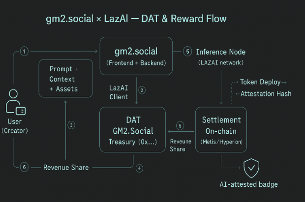

# GM2 LazAI DAT Processor

A Node.js backend service for processing LazAI Data Anchoring Token (DAT) in the GM2 ecosystem. This service handles DAT minting, private data encryption, IPFS storage, and blockchain attestation.

## Demo

For a complete demonstration of the LazAI DAT processing workflow, visit our live demo platform:

🌐 **[Hyperion Demo - hyperion.gm2.social](https://hyperion.gm2.social)**

## Workflow



### Complete End-to-End Flow

```rust
User -> GM2.Social -> LazAI Node -> VerifyComputing Contract -> DB -> Frontend Badge
```

1. **User Interaction**: Creator chats with AI (prompt + context + assets) in GM2.Social to create meme tokens.
2. **Data Contribution & DAT Minting**: GM2.Social Backend contributes data and mints DAT to GM2.Social Treasury, returns `jobId` + `fileId` (stored in backend)

3. **LazAI Inference**: Backend calls LazAI Inference Node (OpenAI-style) with settlement headers containing `fileId`

4. **On-chain Settlement**: Request reward mints DAT with owner = GM2.Social Treasury

5. **Attestation Tracking**: Cron job queries VerifyComputing contract to store `attestationHash` with the user's meme token in database and return to frontend

6. **AI-Attested Badge**: Frontend displays AI-attested badge for meme tokens that have `attestationHash`

7. **Revenue Share** (Optional): GM2.Social shares portion of revenue back to users (creators) or via leaderboard (points)

## Overview

The GM2 LazAI DAT Processor is responsible for:

- Minting Data Anchoring Tokens (DAT) for projects
- Encrypt & store private data on IPFS
- Interacting with LazAI's verified computing nodes
- Processing on-chain attestations and proof verification
- Managing job queues for asynchronous processing

## Features

- **Data Encryption**: RSA + project-specific keys
- **IPFS Integration**: Pinata-based storage
- **LazAI Integration**: Verified computing nodes
- **Blockchain Processing**: Automated attestations
- **Job Queue Management**: Redis + BullMQ with retries
- **Database Integration**: MySQL (TypeORM)
- **Modular Architecture**: Dependency injection

## Technology Stack

- **Runtime**: Node.js with TypeScript
- **Framework**: Custom BlazJS framework
- **Database**: MySQL with TypeORM
- **Queue**: Redis with BullMQ
- **Blockchain**: Ethers.js for Ethereum interactions
- **Storage**: IPFS via Pinata
- **Encryption**: RSA encryption and custom data encryption
- **Container**: Docker support

## Prerequisites

- Node.js 22+
- MySQL database
- Redis server
- IPFS access (via Pinata)
- LazAI network access

## Installation

1. Clone the repository:

```bash
git clone <repository-url>
cd gm2-lazai-dat-processor
```

2. Install dependencies:

```bash
npm install
```

3. Configure environment variables (see Configuration section)

4. Build the project:

```bash
npm run build
```

5. Start the service:

```bash
npm start
```

## Development

For development with hot reload:

```bash
npm run start:dev
```

## Configuration

Configure the following environment variables:

### Database Configuration

```bash
MASTER_DB='{"host":"localhost","port":3306,"username":"user","password":"pass","database":"gm2"}'
SLAVES_DB='[{"host":"localhost","port":3306,"username":"user","password":"pass","database":"gm2"}]'
```

### Redis Configuration

```bash
REDIS='{"host":"localhost","port":6379,"password":"","db":0}'
```

### LazAI Configuration

```bash
LAZAI_CONFIG='{"privateKey":"your-private-key","rpc":"https://rpc-url","contractAddress":"0x...","encryptionSeed":"seed"}'
```

### IPFS Configuration

```bash
IPFS_JWT="your-pinata-jwt-token"
```

### Application Configuration

```bash
APP_ENV="development"
PORT="3000"
```

## API Endpoints

The service provides the following job processors:

### LazAI DAT Minting

- **Queue**: `lazai-mint-dat`
- **Purpose**: Mints new DAT tokens for projects
- **Payload**:
  ```typescript
  {
    tokenAddress: string;
    fileName: string;
    privacyData: number[];
  }
  ```

### Attestator Fetching

- **Queue**: `lazai-fetch-attestator`
- **Purpose**: Fetches blockchain attestation data
- **Payload**:
  ```typescript
  {
    blockNumber: number
    tokenAddress: string
    fileId: string
  }
  ```

## Architecture

### Core Components

#### Services

- **LazAIService**: Main service for DAT minting and LazAI interactions
- **AppConfig**: Configuration management with validation
- **AppDataSource**: Database connection and management

#### Processors

- **LazAIMintDATProcessor**: Handles DAT minting jobs
- **LazAIFetchAttestatorProcessor**: Processes attestation fetching
- **LazAICronFetchAttestatorProcessor**: Scheduled attestation updates

#### Entities

- **LazAIMintDAT**: Database entity for minted DAT records
- **Project**: Project entity with AI attestation status

#### DTOs

- **LazAIMintDataDTO**: Data transfer object for minting operations
- **LazAIFetchAttestatorDataDTO**: DTO for attestation fetching

### Data Flow

1. **DAT Minting Request**: Service receives a request to mint DAT for a project
2. **Data Encryption**: Privacy data is encrypted using project-specific keys
3. **IPFS Upload**: Encrypted data is uploaded to IPFS via Pinata
4. **LazAI Registration**: File is registered with LazAI network
5. **Proof Request**: Verification proof is requested from computing nodes
6. **Reward Processing**: DAT reward is claimed on blockchain
7. **Attestation Tracking**: Service tracks attestation status

## Docker Deployment

Build and run with Docker:

```bash
# Build image
docker build -t gm2-lazai-dat-processor .

# Run container
docker run -d \
  --name gm2-lazai-processor \
  -p 3003:3003 \
  --env-file .env \
  gm2-lazai-dat-processor
```

## Monitoring

The service includes:

- Structured logging with configurable levels
- Job queue monitoring via Bull Board
- Database connection health checks
- Automatic reconnection handling

## Error Handling

- Exponential backoff retry for failed jobs
- Comprehensive error logging
- Graceful handling of network failures
- Database transaction rollback on errors

## Security

- RSA encryption for sensitive data transmission
- Secure key management via environment variables
- Input validation using class-validator
- Protected API endpoints

## Support

For technical support or questions about the GM2 LazAI DAT Processor, please contact the development team.
